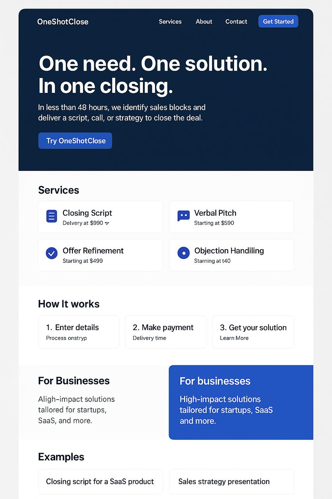

# 🧠 OneShotClose — Générateur de Résolutions Commerciales Instantanées

> Closer digital express & IA de résolution instantanée pour offres bloquées.

OneShotClose est une application et un système conçu pour aider les entreprises, freelances, infopreneurs ou agences à **débloquer des offres commerciales** grâce à des **closings ultra-ciblés**, générés automatiquement à partir de simples messages, emails ou vocaux, sans dépendre d’applications tierces.

---

## 🎯 Mission

> Permettre à un client d’exprimer un blocage ou un besoin commercial (par message ou audio), et générer automatiquement :
- un diagnostic clair
- un script de réponse
- un plan de conversion
- et une livraison immédiate de la solution

---

## 🧩 Fonctionnement de l’Application

### 1. Réception de la Demande
- Via un champ texte, formulaire ou message vocal
- Authentification légère (email anonyme ou lien unique)
- Stockage dans Supabase (table `messages`)

### 2. Interprétation Automatisée
- Analyse par GPT ou fonction NLP (`solve()`)
- Extraction du besoin, du ton, du budget et de l’intention
- Sélection du meilleur format de réponse (script, pitch, plan, tunnel)

### 3. Génération de la Solution
- Fichier généré : `solution.md`, `solution.pdf`, `solution.audio`
- Script commercial ou réponse automatisée personnalisée
- Livrable structuré en moins de 48h (parfois instantané)

### 4. Livraison
- Via lien Supabase sécurisé ou email instantané
- Option de réponse vocale automatique ou script visuel
- Peut déclencher une session Multiplay temps réel si besoin

---

## 🛠️ Stack Technique

| Composant | Usage |
|-----------|-------|
| **Supabase** | Auth, base de données, stockage |
| **Multiplay** | Communication temps réel (coach-client) |
| **GPT / Copilot** | Génération de script, solution, code |
| **TypeScript / Python** | Logique backend `solve()` |
| **GitHub** | Hébergement du code et du README |
| **Vercel / Netlify** | Déploiement du frontend |
| **HTML/Markdown** | Interfaces de réponse, livrables |
| **Zapier / Make (optionnel)** | Envoi automatisé des réponses |

---

## 🔁 Exemple de Parcours Utilisateur

1. 👤 **Client** : “Mon tunnel ne convertit plus, je veux une solution rapide.”
2. ⏳ **OneShotClose** : Reçoit la requête (texte ou vocal)
3. 🧠 **solve()** :
   - Analyse l’intention
   - Génère un plan + script de relance + objection solver
4. 📦 **Livraison** :
   - `.md` + `.pdf` + fichier audio
   - Envoi automatique par lien ou email

---

## 🎙️ Prompt Génératif Universel

```
Tu es un générateur de solution applicative automatisée.
Je veux que tu crées le squelette d’une application résolvant le besoin suivant :

🎯 Problème : [décris ici le problème que l’application doit résoudre]  
🧩 Fonctionnalités attendues :
- [liste des fonctions clés]
- Résolution en moins de [X] étapes
- Interface simple ou console / mobile / web (préciser)

🛠️ Contraintes techniques :
- Pas d’app tierce lourde ou plateforme nocode
- Utiliser Supabase (base, auth, stockage)
- Utiliser Multiplay (temps réel)
- Écriture du code en [TypeScript | Python]
- Optimisation pour résolution rapide

🎁 Livrable attendu :
- Code de l’application prêt à l’emploi
- Arborescence du projet
- Fichiers clés (index.ts, supabase.js, ui.html, etc.)
- Fonction principale `solve()` pour traiter la demande

📦 Mode de livraison : projet unifié, sans dépendance inutile
```

---

## 📦 Exemple de Cas Rempli

```
🎯 Problème : Mon offre ne convertit plus. J’ai besoin d’un tunnel de relance vocal.
🧩 Fonctionnalités :
- Interface vocale pour envoyer un message
- Génération automatique d’un script de relance
- Résultat envoyé en PDF + audio
- Résolution en 24h

🛠️ Contraintes :
- Supabase pour storage et auth anonyme
- Multiplay pour sync si coach intervient
- TypeScript
```

---

## 📁 Arborescence du Projet

```
oneshotclose/
├── public/
│   └── index.html
├── src/
│   ├── solve.ts        # Fonction principale de traitement
│   ├── pitchgen.ts     # Générateur de pitch
│   ├── scriptgen.ts    # Générateur de script commercial
│   └── objection_solver.ts
├── supabase/
│   ├── schema.sql
│   └── supabaseClient.ts
├── docs/
│   └── exemples/
├── README.md
```

---

## 🔒 Espace Outils Internes (admin)

Accessible via `/tools` :

- `solve()` tester
- Générateur de livrables
- Générateur vocal
- Formulaire de debug commercial
- Système d’analyse d’objection en ligne
- Agent de réponse express

---

## 💰 Monétisation

| Offre | Description | Prix |
|-------|-------------|------|
| Script express | Livraison en 24–48h | 690€ |
| Diagnostic verbal + écrit | Tunnel + Plan + Pitch | 990€ |
| App IA livrée clé en main | Avec `solve()` auto | 1 490€ |
| Service “Black Ops” | Close en direct avec agent IA | sur devis |

---

## 🧪 Roadmap

- [x] Générateur `solve()`
- [x] Prompt universel de génération
- [ ] UI mobile (audio to brief)
- [ ] Intégration Supabase full auth
- [ ] Générateur de landing à partir de besoin
- [ ] API REST pour intégration externe

---

## 🤝 Contribuer

1. Fork ce dépôt
2. Propose ton propre prompt ou besoin
3. Push ton script dans `/src/`
4. Ouvre une pull request ✨

---

## 📬 Contact

- 📧 Email : hello@oneshotclose.io
- 🌐 Site web : [en cours de génération]
- 🧠 Créé pour les builders, closer & IA engineers.

---

## 🌀 Bonus

> Ce projet est conçu pour te rendre **indépendant des apps** et **propriétaire de ta résolution commerciale**, grâce au langage, à l’automatisation, et à l’intelligence synthétique.  
Tu deviens un **codeur-closer**, un **IA designer**, un **opérateur de solutions**.

---

**One need. One prompt. OneShotClose.**


